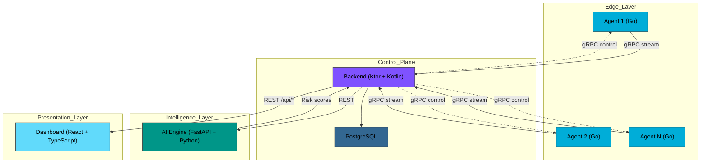
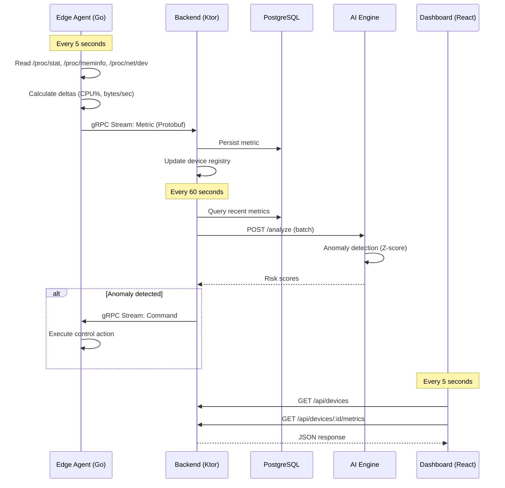
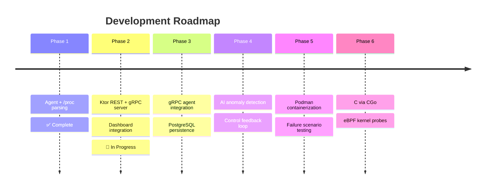

<div align="center">

# 🌐 Intelligent Edge Telemetry & Control System

[](https://github.com/Yahia995/edge-telemetry)
[](https://go.dev)
[](LICENSE)
[](https://kernel.org)

**A distributed information system for real-time edge device monitoring with AI-driven anomaly detection**

[Overview](#-overview) • [Architecture](#-architecture) • [Quick Start](#-quick-start) • [Project Status](#-project-status) • [Roadmap](#-roadmap)

</div>

---

## 📋 Table of Contents

- [Overview](#-overview)
- [Architecture](#-architecture)
- [Technology Stack](#-technology-stack)
- [Project Status](#-project-status)
- [Quick Start](#-quick-start)
- [Project Structure](#-project-structure)
- [Roadmap](#-roadmap)
- [Performance](#-performance)
- [License](#-license)

---

## 🎯 Overview

This project is a **Projet SI** (Information System project) demonstrating end-to-end distributed systems design — from Linux kernel interfaces and `/proc` parsing, through a Ktor coordination backend, to an AI anomaly detection engine.

### Problem Statement

Modern edge environments require:
- **Real-time monitoring** of resource-constrained devices with negligible overhead
- **Structured telemetry** that survives schema evolution
- **Intelligent anomaly detection** without human intervention
- **Automated control feedback** to prevent failures before they occur

### Design Philosophy

The system is built in deliberate phases, with architecture and reasoning before implementation:

- **Go first, C later** — the Linux agent is built in Go to establish correctness. C is introduced only in Phase 6 where kernel-level access (eBPF) genuinely requires it.
- **Clean separation of concerns** — each component has one responsibility. Collectors only read, the backend only coordinates, the AI engine only reasons.
- **Justified trade-offs** — every technology choice is documented against alternatives.

---

## 🏗️ Architecture

### System Overview


### Data Flow


---

## 🛠️ Technology Stack

| Layer | Technology | Justification |
|-------|-----------|---------------|
| **Agent** | Go 1.21+ | Low memory footprint, excellent `/proc` ergonomics, built-in concurrency, single static binary |
| **Transport** | gRPC + Protobuf | Binary serialisation (50–100 bytes vs 500+ for JSON), streaming support, schema evolution via field numbers |
| **Backend** | Ktor (Kotlin) | Coroutine-based async I/O, strong typing, gRPC and REST HTTP in one service |
| **Database** | PostgreSQL 15+ | JSONB for flexible metric payloads, ACID guarantees, TimescaleDB-ready |
| **AI/ML** | Python + FastAPI | Existing ML stack (PyTorch, NumPy, scikit-learn), fast statistical prototyping |
| **Dashboard** | React 19 + TypeScript | Type-safe UI, co-located with types shared from Protobuf schema |
| **Containers** | Podman | Rootless by default, Docker-compatible, better security model |
| **Low-level (Phase 6)** | C + CGo | Introduced only where Go cannot reach: eBPF kernel probes |

---

## 📊 Project Status

### Phase 1: Linux Telemetry Agent ✅ (Complete)

- ✅ Protobuf schema design
- ✅ CPU collector with jiffy delta calculation (`/proc/stat`)
- ✅ Memory collector with `MemAvailable` semantics (`/proc/meminfo`)
- ✅ Network I/O rate collector (`/proc/net/dev`)
- ✅ Stateful delta calculation for rate-based metrics
- ✅ Graceful shutdown on SIGINT / SIGTERM
- ✅ JSON output for validation

**Validation:**

| Metric | Target | Actual |
|--------|--------|--------|
| CPU overhead | < 1% | **0.00%** |
| Memory footprint | < 20 MB | ~10 MB |
| CPU accuracy vs `top` | ± 5% | ± 2% |
| Memory accuracy vs `free` | Exact | Exact |

### Phase 2: Backend + Dashboard Integration 🔄 (In Progress)

- ✅ REST API endpoints (`GET /api/devices`, `/api/devices/:id/metrics`)
- ✅ In-memory device registry
- ✅ Dashboard connected and reading live data
- ✅ CORS configured for dashboard dev server
- [ ] gRPC `TelemetryService.StreamMetrics` implementation
- [ ] Agent migrated from JSON file output to gRPC stream
- [ ] Graceful stream handling and reconnection

### Upcoming

| Phase | Goal | Status |
|-------|------|--------|
| 3 | PostgreSQL persistence + time-range queries | Planned |
| 4 | AI anomaly detection (Python / FastAPI) | Planned |
| 5 | Podman multi-node simulation | Planned |
| 6 | C integration — eBPF kernel probes via CGo | Planned |

---

## 🚀 Quick Start

### Prerequisites
```bash
go version        # >= 1.21
protoc --version  # >= 3.19
```

### Agent
```bash
git clone https://github.com/Yahia995/edge-telemetry.git
cd edge-telemetry/agent

# Generate protobuf code
./scripts/generate-proto.sh

# Build
go build -o bin/agent cmd/agent/main.go

# Run
./bin/agent --device-id=dev1 --interval=5s --output=metrics.json

# Validate (compare with system tools)
tail -f metrics.json
top -d 5
```

### Backend (Phase 2)
```bash
cd edge-telemetry/backend
./gradlew run
# Starts on :8080
```

### Dashboard

See [telemetry-dashboard](https://github.com/Yahia995/telemetry-dashboard) for full setup.
```bash
# Quick start with real backend
VITE_USE_MOCK_API=false VITE_API_URL=http://localhost:8080 npm run dev
```

---

## 📁 Project Structure
```
edge-telemetry/
├── agent/                          # Go telemetry agent (Phase 1 ✅)
│   ├── cmd/agent/
│   │   └── main.go                 # Entry point, signal handling
│   ├── internal/
│   │   ├── collector/
│   │   │   ├── collector.go        # Orchestrator with channels
│   │   │   ├── cpu.go              # /proc/stat parser
│   │   │   ├── memory.go           # /proc/meminfo parser
│   │   │   └── network.go          # /proc/net/dev parser
│   │   └── config/
│   │       └── config.go           # CLI flags
│   ├── proto/
│   │   ├── telemetry.proto         # Protobuf schema
│   │   └── telemetry/              # Generated code (gitignored)
│   ├── scripts/
│   │   └── generate-proto.sh
│   ├── go.mod
│   └── go.sum
├── backend/                        # Ktor backend (Phase 2 🔄)
│   ├── src/main/kotlin/
│   │   ├── Application.kt
│   │   ├── routing/
│   │   └── registry/
│   └── build.gradle.kts
├── ai-engine/                      # Python AI module (Phase 4)
└── README.md
```

---

## 🗺️ Roadmap


**Note on the Go → C progression:** C is intentionally deferred to Phase 6. The Go agent already achieves 0.00% CPU overhead at 5s intervals, which means there is no performance case for C yet. Phase 6 introduces C only because eBPF kernel probes require it — not as an optimisation. This respects the principle of avoiding premature complexity.

---

## ⚡ Performance

**Test environment:** Fedora Workstation 43, kernel 6.18.5, 16-core CPU, 24 GB RAM

| Metric | Value |
|--------|-------|
| CPU overhead (5s interval) | **0.00%** |
| Memory footprint (RSS) | ~10 MB |
| Parse latency per sample | < 1 ms |
| Syscalls per sample | ~10 |

**Scalability projection:**
- 100 agents at 5s interval → 20 metrics/sec → negligible backend load
- 1000 agents at 5s interval → 200 metrics/sec → batching required (Phase 3)

---

## 📄 License

**Business Source License 1.1 (BSL 1.1)**

- Allowed: Non-production academic evaluation and grading ("Projet SI")
- Not allowed: Commercial use, production deployment, redistribution for profit

Transitions to **Apache License 2.0** on January 1, 2030. See `LICENSE` for full terms.

---

## 👤 Author

**[@Yahia995](https://github.com/Yahia995)** — Software Engineering Student, Tunisia, 2026

---

<div align="center">

**[⬆ Back to Top](#-intelligent-edge-telemetry--control-system)**

Made with ❤️ for learning distributed systems

</div>
