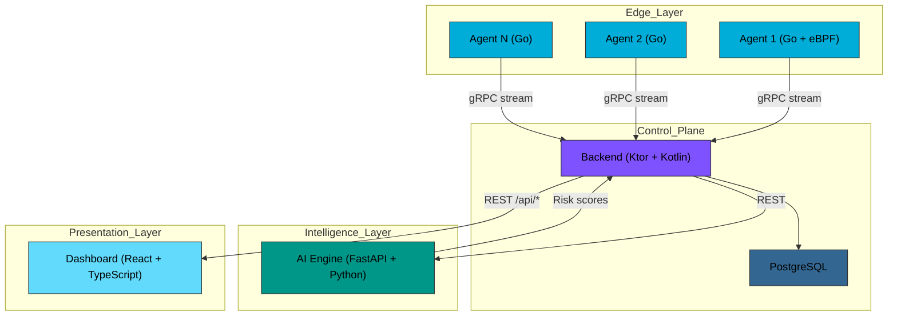
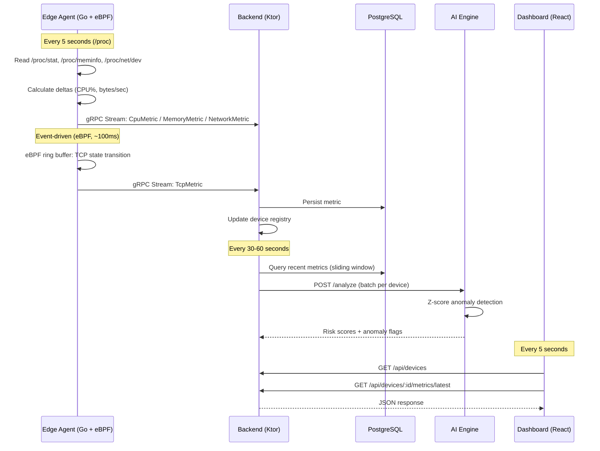
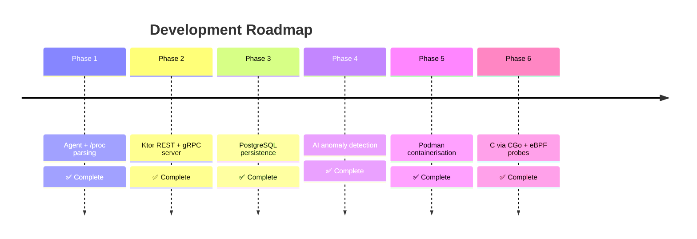

<div align="center">

# 🌐 Intelligent Edge Telemetry & Control System

[](https://github.com/Yahia995/edge-telemetry)
[](https://go.dev)
[](LICENSE)
[](https://kernel.org)

**A distributed information system for real-time edge device monitoring with AI-driven anomaly detection**

[Overview](#-overview) • [Architecture](#-architecture) • [Quick Start](#-quick-start) • [Project Status](#-project-status) • [Roadmap](#-roadmap)

</div>

---

## 📋 Table of Contents

- [Overview](#-overview)
- [Architecture](#-architecture)
- [Technology Stack](#-technology-stack)
- [Project Status](#-project-status)
- [Quick Start](#-quick-start)
- [Project Structure](#-project-structure)
- [Roadmap](#-roadmap)
- [Performance](#-performance)
- [License](#-license)

---

## 🎯 Overview

This project is a **Projet SI** (Information System project) demonstrating end-to-end distributed systems design — from Linux kernel interfaces and `/proc` parsing, through a Ktor coordination backend, to an AI anomaly detection engine.

### Problem Statement

Modern edge environments require:
- **Real-time monitoring** of resource-constrained devices with negligible overhead
- **Structured telemetry** that survives schema evolution
- **Intelligent anomaly detection** without human intervention
- **Automated control feedback** to prevent failures before they occur

### Design Philosophy

The system is built in deliberate phases, with architecture and reasoning before implementation:

- **Go first, C later** — the Linux agent is built in Go to establish correctness. C is introduced only in Phase 6 where kernel-level access (eBPF) genuinely requires it.
- **Clean separation of concerns** — each component has one responsibility. Collectors only read, the backend only coordinates, the AI engine only reasons.
- **Justified trade-offs** — every technology choice is documented against alternatives.

---

## 🏗️ Architecture

### System Overview


### Data Flow


---

## 🛠️ Technology Stack

| Layer | Technology | Justification |
|-------|-----------|---------------|
| **Agent** | Go 1.21+ | Low memory footprint, excellent `/proc` ergonomics, built-in concurrency, single static binary |
| **eBPF** | C + libbpf via CGo | Kernel-level TCP tracepoint access requires C; introduced only at Phase 6 where Go cannot reach |
| **Transport** | gRPC + Protobuf | Binary serialisation (50–100 bytes vs 500+ for JSON), streaming support, schema evolution via field numbers |
| **Backend** | Ktor (Kotlin) | Coroutine-based async I/O, strong typing, gRPC and REST in one service |
| **Database** | PostgreSQL 16 | JSONB-free typed schema, composite indexes, TimescaleDB-ready for Phase 7 |
| **AI/ML** | Python + FastAPI | Existing ML stack (PyTorch, NumPy, scikit-learn), fast statistical prototyping |
| **Dashboard** | React 19 + TypeScript | Type-safe UI, co-located with types shared from Protobuf schema |
| **Containers** | Podman | Rootless by default, Docker-compatible, better security model |

---

## 📊 Project Status

### Phase 1: Linux Telemetry Agent ✅

- ✅ Protobuf schema design (`cpu`, `memory`, `network` payloads)
- ✅ CPU collector with jiffy delta calculation (`/proc/stat`)
- ✅ Memory collector with `MemAvailable` semantics (`/proc/meminfo`)
- ✅ Network I/O rate collector (`/proc/net/dev`)
- ✅ Stateful delta calculation for rate-based metrics
- ✅ Graceful shutdown on SIGINT / SIGTERM
- ✅ JSON output for validation

### Phase 2: Backend + gRPC Integration ✅

- ✅ `TelemetryService.StreamMetrics` gRPC server (Ktor + coroutine flow)
- ✅ Agent migrated from JSON file output to live gRPC stream
- ✅ Exponential backoff reconnection (2s → 30s) in the agent
- ✅ REST API: `GET /api/devices`, `/api/devices/:id/metrics/latest`, `/api/devices/:id/metrics`
- ✅ CORS configured for dashboard dev server
- ✅ Mock device seeding for dashboard development without a running agent

### Phase 3: PostgreSQL Persistence ✅

- ✅ `TelemetryRepository` interface — typed ingest + read contract
- ✅ `InMemoryRepository` — zero-dependency fallback, preserves Phase 2 behaviour
- ✅ `PostgresRepository` — Exposed DSL, HikariCP connection pool
- ✅ Schema: `devices`, `metric_cpu`, `metric_memory`, `metric_network` with composite indexes
- ✅ `touchDevice()` upsert — atomic, race-free on concurrent agent connections
- ✅ `AppConfig` — twelve-factor environment variable configuration
- ✅ `DATABASE_URL` absent → in-memory; present → PostgreSQL (single decision point)

### Phase 4: AI Anomaly Detection ✅

- ✅ FastAPI AI engine (`ai-engine/`) with Z-score algorithm
- ✅ `ZScoreAnalyzer` — stateless, operates on sliding window, no training data required
- ✅ `AnomalyScheduler` — coroutine loop, per-device analysis, SupervisorJob isolation
- ✅ `AiEngineClient` — Ktor CIO HTTP client, null-on-failure (AI engine is optional)
- ✅ `AI_ENGINE_URL` absent → scheduler disabled; present → scheduler starts
- ✅ ANOMALY log lines at WARN with full z-score diagnostics

### Phase 5: Podman Containerisation ✅

- ✅ `agent/Containerfile` — multi-stage Go build, static binary, Alpine runtime
- ✅ `backend/Containerfile` — Gradle `installDist`, eclipse-temurin JRE Alpine
- ✅ `ai-engine/Containerfile` — python:3.12-slim, non-root, pip layer caching
- ✅ Root `compose.yaml` — 6 services on private bridge network, healthcheck ordering
- ✅ Env var config on agent (`DEVICE_ID`, `BACKEND_ADDR`, `SAMPLING_INTERVAL`)
- ✅ Failure simulation scripts: agent disconnect, backend restart, CPU anomaly injection

### Phase 6: C Integration — eBPF Kernel Probes ✅

- ✅ `ebpf/tcp_events.h` — shared struct (kernel ↔ userspace), 36 bytes, explicit padding
- ✅ `ebpf/tcp_events.c` — BPF tracepoint `sock/inet_sock_set_state`, ring buffer output
- ✅ `internal/ebpf/loader.h` — narrow C API (5 functions, no libbpf types exposed)
- ✅ `internal/ebpf/loader.c` — libbpf userspace loader, static batch buffer
- ✅ `internal/ebpf/ebpf.go` — CGo bridge (`//go:build linux`), copies events to Go heap
- ✅ `TcpMetric` proto message at field 13 — wire-compatible with existing messages
- ✅ Event-driven `TcpCollector` (100ms poll) alongside ticker-based `/proc` collectors
- ✅ `ENABLE_EBPF` flag — non-fatal if unavailable, `/proc` collectors always run
- ✅ `Makefile` — `clang -target bpf` compilation + Go CGo build in one invocation
- ✅ `compose.yaml` — `agent-dev1` with CAP_BPF/CAP_PERFMON, dev2/dev3 as control group

**Validation:**

| Metric | Target | Actual |
|--------|--------|--------|
| CPU overhead (5s interval) | < 1% | **0.00%** |
| Memory footprint (RSS) | < 20 MB | ~10 MB |
| CPU accuracy vs `top` | ± 5% | ± 2% |
| Memory accuracy vs `free` | Exact | Exact |
| TCP event latency | < 200ms | ~100ms |

---

## 🚀 Quick Start

### Prerequisites
```bash
go version        # >= 1.21
protoc --version  # >= 3.19
java --version    # >= 21
podman --version  # >= 5.0
```

### Option A: Full stack (Podman)
```bash
git clone https://github.com/Yahia995/edge-telemetry.git
cd edge-telemetry

podman-compose up -d

# Follow the startup sequence
podman-compose logs -f backend   # wait for "gRPC server started"
podman-compose logs -f agent-dev1

# Verify metrics in PostgreSQL
podman exec telemetry-postgres \
  psql -U telemetry -d telemetry \
  -c "SELECT device_id, COUNT(*) FROM metric_cpu GROUP BY device_id;"

# Verify TCP events from the eBPF agent
podman-compose logs backend | grep "TCP  device=dev1"
```

### Option B: Local dev (no containers)
```bash
# Terminal 1 — PostgreSQL only
cd backend && podman-compose up -d

# Terminal 2 — backend
DATABASE_URL=jdbc:postgresql://localhost:5432/telemetry \
AI_ENGINE_URL=http://localhost:8000 \
./gradlew run

# Terminal 3 — AI engine
mlenv
cd ai-engine && python main.py

# Terminal 4 — agent (/proc only)
cd agent
./scripts/generate-proto.sh
go build -o bin/agent cmd/agent/main.go
./bin/agent --device-id=dev1 --interval=5s

# Terminal 5 — agent with eBPF (requires CAP_BPF)
cd agent && make
sudo -E ./bin/agent --device-id=dev1-ebpf --ebpf --bpf-object=ebpf/tcp_events.o
```

### Failure scenarios
```bash
chmod +x scripts/*.sh

./scripts/sim-agent-disconnect.sh dev2 30   # disconnect + reconnect
./scripts/sim-backend-restart.sh            # restart under live load
./scripts/sim-high-cpu.sh dev1 60           # trigger anomaly detection
```

---

## 📁 Project Structure
```
edge-telemetry/
├── agent/                              # Go telemetry agent
│   ├── cmd/agent/
│   │   └── main.go                     # Entry point, signal handling
│   ├── ebpf/                           # Phase 6: C/BPF sources
│   │   ├── tcp_events.h                # Shared event struct (kernel ↔ user)
│   │   └── tcp_events.c                # BPF tracepoint program
│   ├── internal/
│   │   ├── collector/
│   │   │   ├── collector.go            # Orchestrator: ticker + eBPF goroutines
│   │   │   ├── cpu.go                  # /proc/stat parser
│   │   │   ├── memory.go               # /proc/meminfo parser
│   │   │   ├── network.go              # /proc/net/dev parser
│   │   │   └── tcp_collector.go        # Phase 6: eBPF ring buffer consumer
│   │   ├── config/
│   │   │   └── config.go               # CLI flags + env vars
│   │   └── ebpf/
│   │       ├── loader.h                # C API boundary (no libbpf types)
│   │       ├── loader.c                # libbpf userspace loader
│   │       └── ebpf.go                 # CGo bridge (//go:build linux)
│   ├── proto/
│   │   ├── telemetry.proto             # Schema: Metric, TcpMetric, Ack
│   │   └── telemetry/                  # Generated Go stubs (gitignored)
│   ├── scripts/
│   │   └── generate-proto.sh
│   ├── Containerfile                   # Multi-stage: clang + Go build → Alpine
│   ├── Makefile                        # BPF compile + Go CGo build
│   ├── go.mod
│   └── go.sum
├── backend/                            # Ktor coordination server
│   ├── src/main/
│   │   ├── kotlin/app/edge_telemetry/
│   │   │   ├── Application.kt          # Server wiring, buildRepository()
│   │   │   ├── ai/
│   │   │   │   ├── AiEngineClient.kt   # Ktor CIO HTTP client
│   │   │   │   ├── AnomalyModels.kt    # Request/response types
│   │   │   │   └── AnomalyScheduler.kt # Periodic analysis coroutine
│   │   │   ├── config/
│   │   │   │   └── AppConfig.kt        # Twelve-factor env var config
│   │   │   ├── grpc/
│   │   │   │   └── TelemetryGrpcService.kt  # Proto→model boundary
│   │   │   ├── models/
│   │   │   │   └── Models.kt           # Kotlin model types
│   │   │   ├── routes/
│   │   │   │   └── DeviceRoutes.kt     # REST endpoint handlers
│   │   │   └── storage/
│   │   │       ├── TelemetryRepository.kt   # Storage interface
│   │   │       ├── InMemoryRepository.kt    # In-memory implementation
│   │   │       └── PostgresRepository.kt    # Exposed DSL + HikariCP
│   │   ├── proto/
│   │   │   └── telemetry.proto         # Wire-identical to agent proto
│   │   └── resources/
│   │       ├── db/
│   │       │   └── init.sql            # PostgreSQL schema + indexes
│   │       └── logback.xml
│   ├── Containerfile                   # Gradle installDist → JRE Alpine
│   ├── compose.yaml                    # PostgreSQL dev container
│   └── build.gradle.kts
├── ai-engine/                          # Python anomaly detection
│   ├── main.py                         # FastAPI: POST /analyze, GET /health
│   ├── analyzer.py                     # ZScoreAnalyzer (stateless)
│   ├── models.py                       # Pydantic request/response types
│   ├── requirements.txt
│   └── Containerfile                   # python:3.12-slim
├── scripts/                            # Failure simulation
│   ├── sim-agent-disconnect.sh
│   ├── sim-backend-restart.sh
│   └── sim-high-cpu.sh
├── compose.yaml                        # Full stack: 6 services
└── README.md
```

---

## 🗺️ Roadmap


**Note on the Go → C progression:** C is introduced at Phase 6 because eBPF kernel probes require it — not as an optimisation. The Go agent already achieves 0.00% CPU overhead at 5s intervals. C is the correct tool when the interface exists only in kernel C headers (libbpf, BPF maps, tracepoints). The CGo boundary in `loader.h` is kept deliberately narrow: no libbpf types cross it, so Go code above `ebpf.go` is entirely free of C.

---

## ⚡ Performance

**Test environment:** Fedora 43, kernel 6.18.5, 16-core CPU, 24 GB RAM, RTX 3050 4GB

| Metric | Value |
|--------|-------|
| CPU overhead — /proc collectors (5s interval) | **0.00%** |
| CPU overhead — eBPF TCP collector (100ms poll) | < 0.01% |
| Memory footprint (RSS) | ~10 MB |
| Parse latency per /proc sample | < 1 ms |
| TCP event latency (kernel → metric stream) | ~100 ms |
| Syscalls per /proc sample | ~10 |

**Scalability:**
- 100 agents at 5s interval → 20 metrics/sec → negligible backend load
- 1000 agents at 5s interval → 200 metrics/sec → batching recommended (TimescaleDB, Phase 7)

---

## 📄 License

**Business Source License 1.1 (BSL 1.1)**

- Allowed: Non-production academic evaluation and grading ("Projet SI")
- Not allowed: Commercial use, production deployment, redistribution for profit

Transitions to **Apache License 2.0** on January 1, 2030.

---

## 👤 Author

**[@Yahia995](https://github.com/Yahia995)** — Software Engineering Student, Tunisia, 2026

---

<div align="center">

**[⬆ Back to Top](#-intelligent-edge-telemetry--control-system)**

</div>
