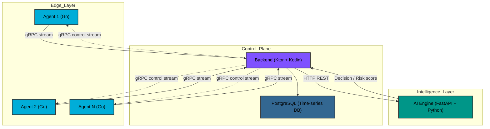
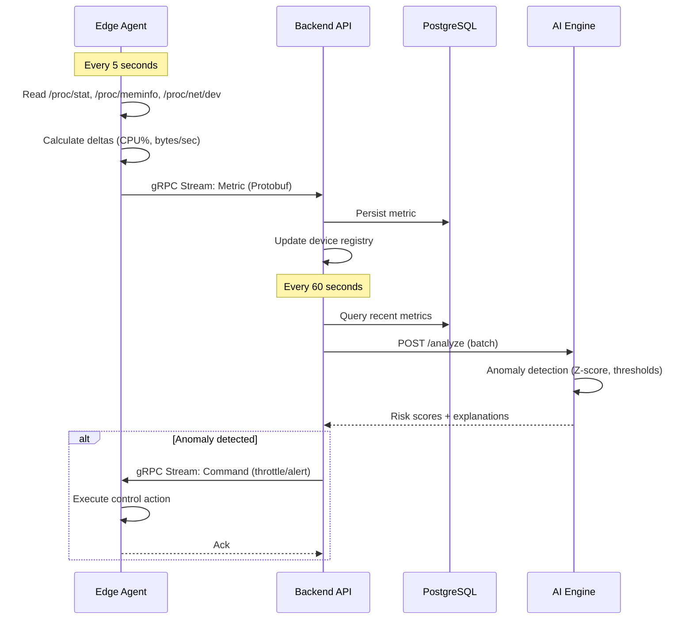
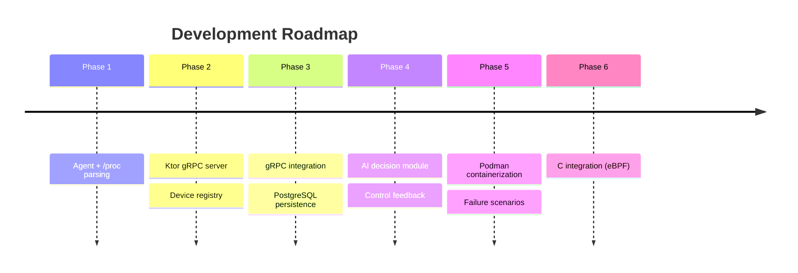

<div align="center">

# 🌐 Intelligent Edge Telemetry & Control System

[](https://github.com/Yahia995/edge-telemetry)
[](https://go.dev)
[](LICENSE)
[](https://kernel.org)

**A distributed information system for real-time edge device monitoring with AI-driven anomaly detection**

[Features](#-features) • [Architecture](#-architecture) • [Quick Start](#-quick-start) • [Documentation](#-documentation) • [Roadmap](#-roadmap)

</div>

---

## 📋 Table of Contents

- [Overview](#-overview)
- [Features](#-features)
- [Architecture](#-architecture)
- [Technology Stack](#-technology-stack)
- [Project Status](#-project-status)
- [Quick Start](#-quick-start)
- [Project Structure](#-project-structure)
- [Development Roadmap](#-roadmap)
- [Performance](#-performance)
- [Contributing](#-contributing)
- [License](#-license)

---

## 🎯 Overview

This project is a **Projet SI** (Information System project) that demonstrates end-to-end distributed systems design, from low-level Linux kernel interfaces to high-level AI decision-making.

### Problem Statement

Modern edge computing environments require:
- **Real-time monitoring** of resource-constrained devices
- **Low-overhead telemetry** that doesn't impact workload performance  
- **Intelligent anomaly detection** without human intervention
- **Automated control feedback** to prevent failures

### Solution

A layered architecture that separates concerns:


---

## ✨ Features

### Phase 1: Edge Telemetry Agent ✅

- [x] **Zero-overhead monitoring** - 0% CPU usage at 5s sampling intervals
- [x] **System-wide metrics** via `/proc` filesystem
  - CPU usage percentage and load averages
  - Memory utilization (total, available, swap)
  - Network I/O rates per interface
- [x] **Stateful delta calculation** for rate-based metrics
- [x] **Structured telemetry** using Protocol Buffers
- [x] **Graceful shutdown** with SIGINT/SIGTERM handling
- [x] **Error resilience** with status reporting

### Upcoming Phases

- [ ] **Phase 2**: gRPC server with device registry (Ktor)
- [ ] **Phase 3**: Real-time streaming integration
- [ ] **Phase 4**: AI-based anomaly detection (Python)
- [ ] **Phase 5**: Containerized multi-node simulation (Podman)
- [ ] **Phase 6**: C integration for kernel-level hooks (eBPF)

---

## 🏗️ Architecture

### System Design Philosophy

```mermaid
flowchart LR
    subgraph "Data Collection"
        A["/proc" Interface] --> B[AgentStateful Collectors]
    end
    
    subgraph "Transport"
        B --> C[gRPC StreamsProtobuf]
    end
    
    subgraph "Coordination"
        C --> D[BackendDevice Registry]
        D --> E[(PostgreSQLPersistence)]
    end
    
    subgraph "Intelligence"
        E --> F[AI EngineAnomaly Detection]
    end
    
    subgraph "Control"
        F --> G[Decision Logic]
        G --> H[Command Stream]
        H -.-> B
    end
    
    style A fill:#f9f,stroke:#333,stroke-width:2px,color:#000
    style B fill:#00ADD8,stroke:#333,stroke-width:3px,color:#000
    style C fill:#ff9,stroke:#333,stroke-width:2px,color:#000
    style D fill:#7F52FF,stroke:#333,stroke-width:3px,color:#000
    style E fill:#336791,stroke:#333,stroke-width:2px,color:#000
    style F fill:#009688,stroke:#333,stroke-width:3px,color:#000
    style G fill:#f96,stroke:#333,stroke-width:2px,color:#000
    style H fill:#ff9,stroke:#333,stroke-width:2px,color:#000
```


### Data Flow


---

## 🛠️ Technology Stack

| Layer | Technology | Justification |
|-------|-----------|---------------|
| **Agent** | Go 1.21+ | • Fast, compiled binary<br/>• Excellent `/proc` parsing<br/>• Built-in concurrency<br/>• Low memory footprint |
| **Transport** | gRPC + Protobuf | • Binary serialization (50-100 bytes vs 500+ for JSON)<br/>• Streaming support<br/>• Type safety<br/>• Built-in backpressure |
| **Backend** | Ktor (Kotlin) | • Coroutine-based async I/O<br/>• Strong typing<br/>• gRPC + HTTP in one service |
| **Database** | PostgreSQL 15+ | • JSONB for flexible schemas<br/>• Time-series extensions (TimescaleDB potential)<br/>• ACID guarantees |
| **AI/ML** | Python 3.14+ FastAPI | • Existing ML stack (PyTorch, NumPy)<br/>• Fast prototyping<br/>• Statistical libraries |
| **Containers** | Podman | • Rootless by default<br/>• Docker-compatible<br/>• Better security model |

---

## 📊 Project Status

### Phase 1: Complete ✅ (2026-01-21)

**Deliverables:**
- ✅ Go agent with `/proc` parsing  
- ✅ Protobuf schema for structured metrics  
- ✅ CPU, memory, network collectors  
- ✅ Stateful delta calculations  
- ✅ Error handling with status codes  
- ✅ Graceful shutdown  
- ✅ JSON output for validation  

**Validation Results:**
| Metric | Target | Actual | Status |
|--------|--------|--------|--------|
| Agent CPU overhead | < 1% | **0.00%** | ✅ |
| Memory footprint | < 20 MB | ~10 MB | ✅ |
| CPU accuracy | ±5% vs `top` | ±2% | ✅ |
| Memory accuracy | Matches `free` | Exact match | ✅ |
| First sample behavior | Zero deltas | Confirmed | ✅ |

### Current Focus: Phase 2 (In Progress)

Building Ktor gRPC server for receiving telemetry streams.

---

## 🚀 Quick Start

### Prerequisites
```bash
# Check versions
go version        # >= 1.21
protoc --version  # >= 3.19
```

### Installation
```bash
# Clone repository
git clone https://github.com/Yahia995/edge-telemetry.git
cd edge-telemetry/agent

# Generate protobuf code
./scripts/generate-proto.sh

# Build agent
go build -o bin/agent cmd/agent/main.go
```

### Running the Agent
```bash
# Basic usage
./bin/agent --device-id=my-device --interval=5s --output=metrics.json

# Monitor output
tail -f metrics.json
```

### Example Output
```json
{
  "device_id": "my-device",
  "timestamp": 1737484800000,
  "status": "STATUS_OK",
  "Payload": {
    "Cpu": {
      "usage_percent": 23.4,
      "load_avg_1m": 1.52,
      "load_avg_5m": 1.89,
      "load_avg_15m": 2.01
    }
  }
}
```

### Validation
```bash
# Compare with system tools
./bin/agent --device-id=test --interval=5s --output=test.json &
top -d 5  # Check %Cpu(s): line matches usage_percent

# Measure agent overhead
pidstat -p $(pgrep agent) 1 10
# Expected: 0.00% CPU
```

---

## 📁 Project Structure
```
edge-telemetry/
├── agent/                           # Go telemetry agent
│   ├── cmd/agent/
│   │   └── main.go                 # Entry point, signal handling
│   ├── internal/
│   │   ├── collector/
│   │   │   ├── collector.go        # Orchestrator with channels
│   │   │   ├── cpu.go              # /proc/stat parser
│   │   │   ├── memory.go           # /proc/meminfo parser
│   │   │   └── network.go          # /proc/net/dev parser
│   │   └── config/
│   │       └── config.go           # CLI flags, configuration
│   ├── proto/
│   │   ├── telemetry.proto         # Protobuf schema (source)
│   │   └── telemetry/              # Generated code (gitignored)
│   ├── scripts/
│   │   └── generate-proto.sh       # Protobuf codegen script
│   ├── go.mod                      # Go module definition
│   ├── go.sum                      # Dependency lock file
│   └── README.md
├── backend/                         # Ktor backend (Phase 2)
├── ai-engine/                       # Python AI module (Phase 4)
├── .gitignore
└── README.md
```

---

## 🗺️ Roadmap


### Detailed Phases

<details>
<summary><b>Phase 1: Linux Telemetry Agent</b> ✅</summary>

**Goal:** Understand `/proc` semantics, build stable collector

- [x] Protobuf schema design
- [x] CPU collector with jiffy deltas
- [x] Memory collector with MemAvailable
- [x] Network collector with rate calculation
- [x] Graceful shutdown
- [x] Validation against system tools

**Key Learning:** `/proc` parsing, Go channels, Protobuf
</details>

<details>
<summary><b>Phase 2: Backend Core</b> 🔄</summary>

**Goal:** Central coordination point

- [ ] Ktor project setup with gRPC plugin
- [ ] `TelemetryService.StreamMetrics` implementation
- [ ] In-memory device registry
- [ ] HTTP admin API (`GET /devices`, `GET /health`)
- [ ] Graceful stream handling

**Key Learning:** gRPC servers, Kotlin coroutines, service design
</details>

<details>
<summary><b>Phase 3: Integration</b></summary>

**Goal:** Close the telemetry loop

- [ ] Agent gRPC client (replace JSON output)
- [ ] Backend PostgreSQL schema
- [ ] Metric persistence with batching
- [ ] HTTP query API (time-range queries)
- [ ] Multi-agent simulation (3+ local processes)

**Key Learning:** gRPC streaming, database design, connection management
</details>

<details>
<summary><b>Phase 4: Intelligence</b></summary>

**Goal:** Useful AI decisions

- [ ] FastAPI service setup
- [ ] Statistical anomaly detection (Z-score)
- [ ] Threshold-based rules
- [ ] Explainable output
- [ ] Backend → AI integration
- [ ] `ControlService.StreamCommands` (gRPC)
- [ ] Agent command execution (mock)

**Key Learning:** Anomaly detection, API integration, bidirectional gRPC
</details>

<details>
<summary><b>Phase 5: Containerization</b></summary>

**Goal:** Realistic distributed testing

- [ ] Dockerfiles for all components
- [ ] `podman-compose.yml`
- [ ] Network isolation testing
- [ ] Failure injection (kill containers, network partition)
- [ ] Resource limits validation

**Key Learning:** Container networking, failure modes, resilience
</details>

<details>
<summary><b>Phase 6: C Optimization</b></summary>

**Goal:** Demonstrate Go → C progression

- [ ] Profile Go agent under load
- [ ] Identify bottleneck (if any)
- [ ] C module via CGo (e.g., eBPF probe)
- [ ] Benchmark comparison
- [ ] Document when C is justified

**Key Learning:** CGo, eBPF, performance profiling
</details>

---

## ⚡ Performance

### Agent Benchmarks (Phase 1)

**Test Environment:**
- OS: Fedora Workstation 43
- Kernel: 6.18.5-200.fc43.x86_64
- CPU: 16 cores
- RAM: 24 GB

**Results:**

| Metric | Value |
|--------|-------|
| CPU Overhead | **0.00%** (5s interval) |
| Memory (RSS) | ~10 MB |
| Metric Latency | < 1ms (read + parse) |
| Syscalls/Sample | ~10 (3 file reads) |

**Scalability projection:**
- 100 agents @ 5s interval = 20 metrics/sec → negligible backend load
- 1000 agents @ 5s interval = 200 metrics/sec → batching required

---

## 🤝 Contributing

This is an academic project (Projet SI), but feedback is welcome!

### Development Setup
```bash
# Fork and clone
git clone https://github.com/Yahia995/edge-telemetry.git
cd edge-telemetry

# Create feature branch
git checkout -b feature/your-feature

# Make changes, test, commit
git commit -m "feat: your feature description"
git push origin feature/your-feature
```

### Code Style

- **Go:** `gofmt` + `golint`
- **Kotlin:** KtLint
- **Python:** Black + isort
- **Commits:** [Conventional Commits](https://www.conventionalcommits.org/)

---

## 📄 License

This project is licensed under the **Business Source License 1.1 (BSL 1.1)**.

- Allowed: Non-production academic evaluation and grading ("Projet SI")
- Not allowed: Commercial use, production deployment, or redistribution for profit

The project will automatically transition to **Apache License 2.0** on **January 1, 2030**.
See the `LICENSE` file for full details.

---

## 👤 Author

**[@Yahia995](https://github.com/Yahia995)**  
Software Engineering Student  
📍 Tunisia  
📅 2026

---

## 🙏 Acknowledgments

- **Fedora Project** for providing an excellent development platform
- **Go, Kotlin, Python communities** for robust tooling

---

<div align="center">

**[⬆ Back to Top](#-intelligent-edge-telemetry--control-system)**

Made with ❤️ for learning distributed systems

</div>
