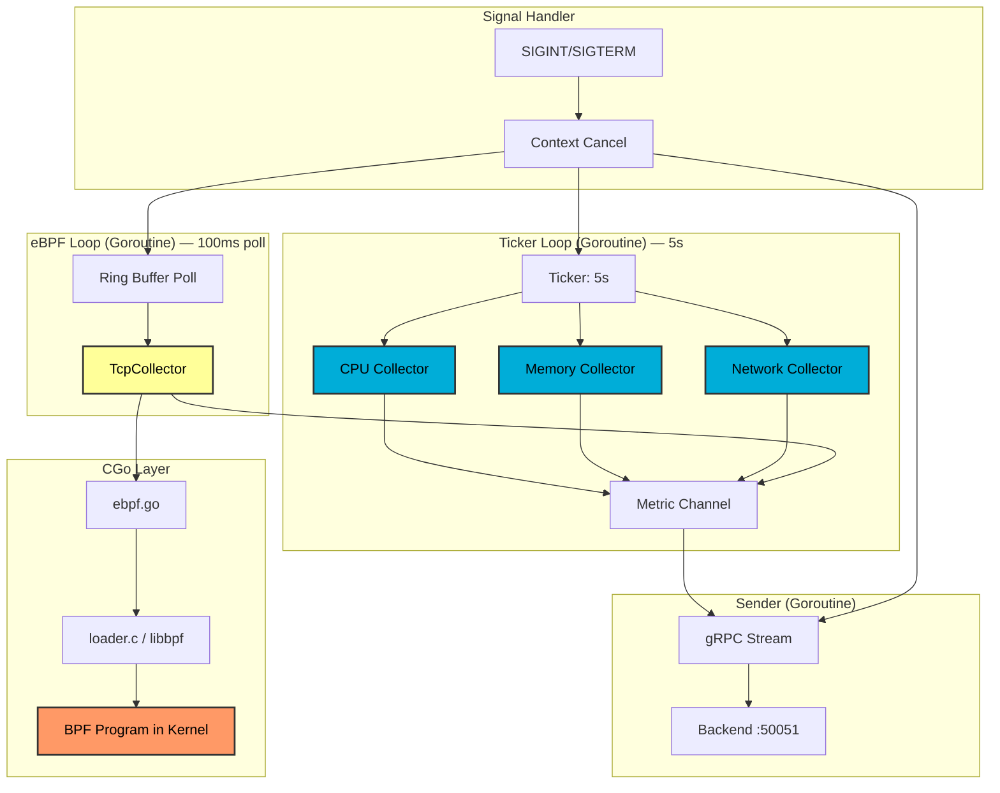

<div align="center">

# Agent - Linux Telemetry Collector

[](https://go.dev)
[](https://kernel.org)
[](.)

Low-overhead system telemetry agent using `/proc` filesystem and eBPF kernel probes.

</div>

---

## 📋 Table of Contents

- [Overview](#overview)
- [Architecture](#architecture)
- [Metrics Collected](#metrics-collected)
- [Building](#building)
- [Configuration](#configuration)
- [Protobuf Schema](#protobuf-schema)
- [Performance](#performance)
- [Testing](#testing)

---

## Overview

The agent collects system metrics via two independent mechanisms:

1. **`/proc` collectors** — CPU, memory, and network I/O polled every 5 seconds. Stateful collectors calculate rate-based metrics (CPU usage %, network bytes/sec) from kernel-provided counters. Zero measurable CPU overhead.

2. **eBPF TCP collector** (Phase 6, opt-in) — attaches to the kernel tracepoint `sock/inet_sock_set_state` and captures TCP connection state transitions in real time. Event-driven: each transition appears in the metric stream within ~100ms, independent of the 5-second poll cycle.

### Design Principles

1. **Stateful delta calculation** — compare successive samples to compute rates
2. **Error resilience** — parse errors don't crash the agent; `/proc` collectors always run
3. **Structured output** — Protocol Buffers for type safety and schema evolution
4. **Graceful shutdown** — SIGINT/SIGTERM handled cleanly
5. **Go first, C only where required** — `/proc` parsing is pure Go; C appears only at the eBPF boundary where libbpf requires it

---

## Architecture

### Component Diagram


### Go → C Boundary

The CGo integration is deliberately narrow. Only `internal/ebpf/ebpf.go` imports C, and only via `loader.h` — which exposes five functions and no libbpf types:

```
tcp_collector.go   (pure Go: TcpCollector, toProto)
       ↓
ebpf.go            (CGo bridge: Loader.Open, PollEvents, Close)
       ↓ CGo boundary
loader.h / loader.c (C: libbpf open, load, attach, ring_buffer__poll)
       ↓
tcp_events.c       (BPF bytecode compiled by clang -target bpf)
       ↓ kernel boundary
tracepoint/sock/inet_sock_set_state
```

No libbpf types (`struct bpf_object`, `struct ring_buffer`) cross the Go side. When libbpf changes its API, only `loader.c` needs updating.

---

## Metrics Collected

### 1. CPU Metrics (`/proc/stat`)

**Calculation:**
```go
deltaTotal = total1 - total0
deltaIdle  = idle1  - idle0   // idle + iowait
usagePercent = 100 * (1 - deltaIdle / deltaTotal)
```

**Fields:** `usage_percent` (0–100), `load_avg_1m`, `load_avg_5m`, `load_avg_15m`

**First sample:** returns `0.0` (no previous state for delta)

---

### 2. Memory Metrics (`/proc/meminfo`)

Uses `MemAvailable` (not `MemFree`) — includes reclaimable page cache, giving the true memory available to new processes without swapping.

**Fields:** `total_kb`, `available_kb`, `used_kb`, `usage_percent`, `swap_total_kb`, `swap_free_kb`, `swap_usage_percent`

---

### 3. Network Metrics (`/proc/net/dev`)

Rate calculation per interface:
```go
rxRate = (rxBytes1 - rxBytes0) / deltaTime   // bytes/sec
txRate = (txBytes1 - txBytes0) / deltaTime
```

**Fields per interface:** `interface_name`, `rx_bytes_per_sec`, `tx_bytes_per_sec`, `rx_errors`, `tx_errors`, `rx_dropped`, `tx_dropped`

---

### 4. TCP Events (eBPF, opt-in)

**Source:** kernel tracepoint `sock/inet_sock_set_state` (stable since kernel 4.16)

**Filtered states:** `ESTABLISHED`, `CLOSE_WAIT`, `FIN_WAIT1`, `TIME_WAIT`, `CLOSE`
Intermediate SYN states are skipped to reduce ring buffer pressure.

**Fields per event:** `pid`, `src_addr`, `dst_addr`, `src_port`, `dst_port`, `old_state`, `new_state`, `comm`

**Why tracepoint over kprobe:**
- Tracepoint ABI is stable across kernel versions
- kprobe targets change with kernel function signatures
- Tracepoint fires only on state changes, not on every packet

---

## Building

### /proc collectors only (no eBPF)
```bash
cd agent
./scripts/generate-proto.sh

go build -o bin/agent cmd/agent/main.go
```

### With eBPF support

**Install prerequisites (Fedora):**
```bash
make prereqs
# installs: clang, libbpf-devel, elfutils-libelf-devel, kernel-devel
```

**Build BPF object + Go binary:**
```bash
make         # compiles ebpf/tcp_events.o then bin/agent (CGO_ENABLED=1)
make bpf     # BPF object only
make agent   # Go binary only (requires pre-built BPF object)
make clean   # remove artefacts
```

**Verify:**
```bash
bin/agent --help
# Flags: --device-id, --backend-addr, --interval, --ebpf, --bpf-object
```

### Container build
```bash
podman build -t edge-agent:latest .
# Stage 1: clang + libbpf + Go build
# Stage 2: Alpine runtime with libbpf
```

---

## Configuration

All flags accept an environment variable as the default. Resolution order: **CLI flag → env var → built-in default.**

| Flag | Env var | Default | Description |
|------|---------|---------|-------------|
| `--device-id` | `DEVICE_ID` | `"unknown"` | Unique device identifier |
| `--interval` | `SAMPLING_INTERVAL` | `5s` | `/proc` polling interval |
| `--backend-addr` | `BACKEND_ADDR` | `localhost:50051` | gRPC server address |
| `--ebpf` | `ENABLE_EBPF` | `false` | Enable eBPF TCP collector |
| `--bpf-object` | `BPF_OBJECT_PATH` | `/app/ebpf/tcp_events.o` | Path to compiled BPF object |

### Examples
```bash
# /proc only, local dev
./bin/agent --device-id=dev1

# /proc only, connect to containerised backend
BACKEND_ADDR=localhost:50051 ./bin/agent --device-id=dev1

# With eBPF (requires CAP_BPF or root)
./bin/agent --device-id=dev1 --ebpf --bpf-object=ebpf/tcp_events.o

# Env var config (container / systemd)
DEVICE_ID=dev1 BACKEND_ADDR=backend:50051 ENABLE_EBPF=true \
  BPF_OBJECT_PATH=/home/agent/ebpf/tcp_events.o \
  ./bin/agent
```

### eBPF capabilities

Running the eBPF collector requires one of:
- **Linux ≥ 5.8:** `CAP_BPF` + `CAP_PERFMON` (preferred, least privilege)
- **Linux < 5.8:** `CAP_SYS_ADMIN` (broader, avoid in production)
- Root user (not recommended)

In the Podman compose setup, `agent-dev1` receives `cap_add: [BPF, PERFMON, NET_ADMIN, SYS_PTRACE]`.

---

## Protobuf Schema

See [`proto/telemetry.proto`](proto/telemetry.proto) for the full schema.

### Key Messages
```protobuf
message Metric {
  string device_id = 1;
  int64 timestamp = 2;        // Unix epoch milliseconds
  MetricStatus status = 3;

  oneof payload {
    CpuMetric     cpu     = 10;
    MemoryMetric  memory  = 11;
    NetworkMetric network = 12;
    TcpMetric     tcp     = 13;  // Phase 6: eBPF TCP events
  }
}

message TcpMetric {
  uint32 pid       = 1;   // Kernel PID
  string src_addr  = 2;   // IPv4 dotted-decimal
  string dst_addr  = 3;
  uint32 src_port  = 4;
  uint32 dst_port  = 5;
  string old_state = 6;   // e.g. "SYN_SENT"
  string new_state = 7;   // e.g. "ESTABLISHED"
  string comm      = 8;   // Process name (max 15 chars)
}
```

Field numbers 10–13 are non-contiguous by design. Fields 1–9 are reserved for future top-level metadata (agent version, hostname, etc.) without breaking existing parsers.

---

## Performance

**Environment:** Fedora 43, kernel 6.18.5, 16-core CPU, 24 GB RAM

| Metric | Value | Notes |
|--------|-------|-------|
| CPU overhead — /proc | **0.00%** | Measured with `pidstat` over 10s |
| CPU overhead — eBPF | **< 0.01%** | Ring buffer poll at 100ms |
| Memory (RSS) | ~10 MB | Stable across 1000+ samples |
| /proc latency/sample | < 1 ms | File read + parse |
| TCP event latency | ~100 ms | Kernel transition → metric stream |
| Syscalls per /proc sample | ~10 | 3 `/proc` reads + logging |

---

## Testing

### Validate /proc accuracy
```bash
# Terminal 1: start agent
./bin/agent --device-id=test --interval=5s --output=metrics.json

# Terminal 2: compare with system tools
watch -n 5 'free -h'   # memory
top -d 5               # CPU (press 1 for per-core)
```

### Validate eBPF TCP events
```bash
# Terminal 1: start agent with eBPF
sudo ./bin/agent --device-id=test --ebpf

# Terminal 2: generate TCP connections
curl https://example.com
# Agent should log a TcpMetric for the connection

# Verify in backend
http GET localhost:8080/api/devices/test/metrics/latest
```

### Validate reconnection
```bash
./bin/agent --device-id=test &
# Kill and restart backend — agent reconnects with exponential backoff
# Logs: "Stream to backend lost" → "Connected to backend"
```

### Overhead measurement
```bash
./bin/agent --device-id=overhead --interval=5s &
pidstat -p $(pgrep agent) 1 20
# Expected: %CPU column shows 0.00 on most samples
```

---

## Troubleshooting

| Issue | Cause | Solution |
|-------|-------|----------|
| `STATUS_PERMISSION_DENIED` | Cannot read `/proc` | Check file permissions |
| `STATUS_PARSE_ERROR` | Unexpected `/proc` format | Check kernel version |
| `loader_open failed: CAP_BPF` | Missing capability | Add `cap_add: [BPF, PERFMON]` or run as root |
| `ebpf/tcp_events.o: no such file` | BPF object not compiled | Run `make bpf` first |
| TCP events not appearing | eBPF disabled | Set `ENABLE_EBPF=true` |
| High CPU (> 1%) | Tight loop or poll interval too short | Profile with `go tool pprof` |

---

<div align="center">

**[⬆ Back to Project Root](../README.md)**

</div>
