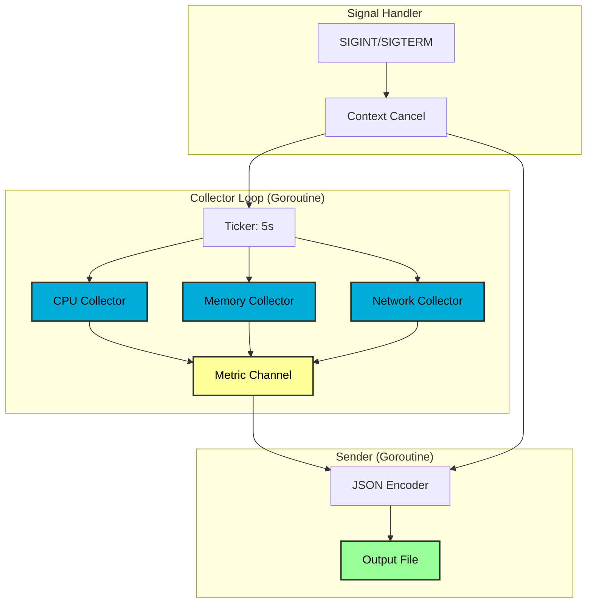
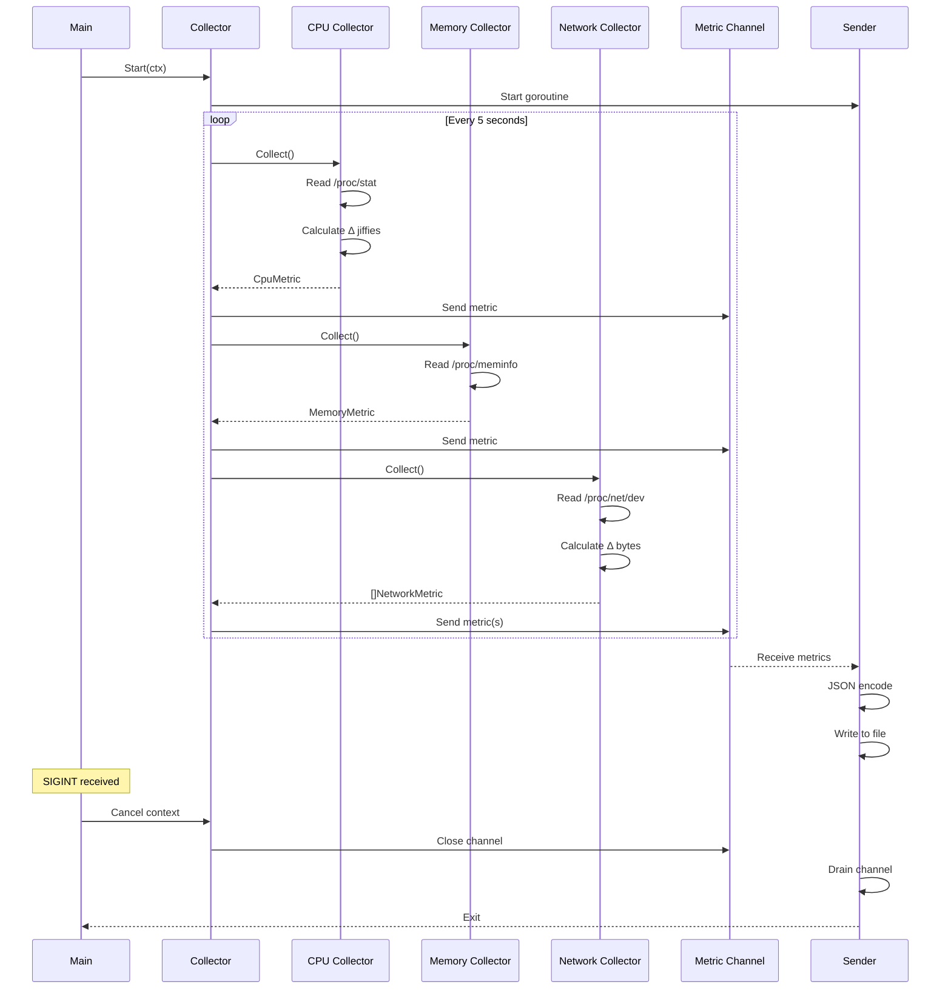
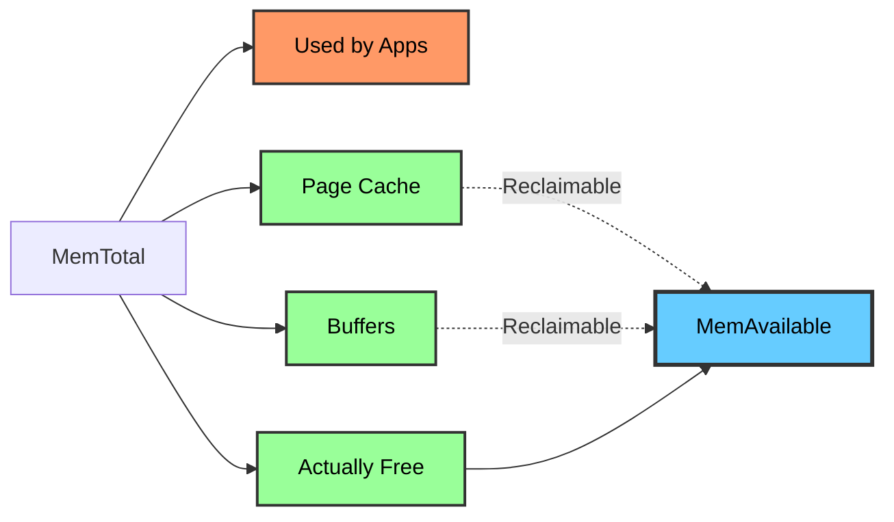
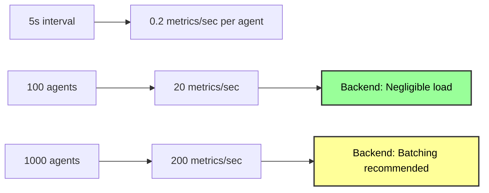

<div align="center">

# Agent - Linux Telemetry Collector

[](https://go.dev)
[](https://kernel.org)
[](.)

Low-overhead system telemetry agent using `/proc` filesystem.

</div>

---

## 📋 Table of Contents

- [Overview](#overview)
- [Architecture](#architecture)
- [Metrics Collected](#metrics-collected)
- [Building](#building)
- [Configuration](#configuration)
- [Protobuf Schema](#protobuf-schema)
- [Performance](#performance)
- [Testing](#testing)

---

## Overview

The agent collects system metrics from the Linux `/proc` pseudo-filesystem with **zero measurable CPU overhead**. It uses stateful collectors to calculate rate-based metrics (CPU usage %, network bytes/sec) from kernel-provided counters.

### Design Principles

1. **Stateful delta calculation** - Compare successive samples to compute rates
2. **Error resilience** - Parse errors don't crash the agent
3. **Structured output** - Protocol Buffers for type safety
4. **Graceful shutdown** - SIGINT/SIGTERM handled cleanly

---

## Architecture

### Component Diagram


### Data Flow


---

## Metrics Collected

### 1. CPU Metrics (`/proc/stat`)

**Source:** `/proc/stat` first line (aggregate across all cores)

**Format:**
```
cpu  4705 150 1820 98234 450 0 120 0 0 0
     ^^^^ user jiffies (and 9 more fields)
```

**Calculation:**
```go
// At time T0
total0 = sum(all jiffy fields)
idle0 = idle + iowait

// At time T1 (5 seconds later)
total1 = sum(all jiffy fields)
idle1 = idle + iowait

// Usage percentage
deltaTotal = total1 - total0
deltaIdle = idle1 - idle0
usagePercent = 100 * (1 - deltaIdle / deltaTotal)
```

**Fields:**
- `usage_percent` (0-100): System-wide CPU usage
- `load_avg_1m`, `load_avg_5m`, `load_avg_15m`: From `/proc/loadavg`

**First sample:** Returns `0.0` (no previous state for delta)

---

### 2. Memory Metrics (`/proc/meminfo`)

**Source:** `/proc/meminfo` key-value pairs

**Why `MemAvailable` not `MemFree`?**


Linux aggressively caches files in RAM. `MemFree` shows only truly unused memory.  
`MemAvailable` = memory available to start new apps **without swapping** (includes reclaimable caches).

**Fields:**
- `total_kb`: Total usable RAM
- `available_kb`: Free + reclaimable caches
- `used_kb`: `total - available`
- `usage_percent`: `100 * used / total`
- `swap_*`: Swap space metrics

---

### 3. Network Metrics (`/proc/net/dev`)

**Source:** `/proc/net/dev` per-interface counters

**Format:**
```
Inter-|   Receive                    |  Transmit
 face |bytes    packets errs drop ...|bytes    packets errs drop ...
  eth0: 98765432  87654    0    0  ...45678901  54321    0    0  ...
```

**Calculation:**
```go
// At T0
rxBytes0 = 98765432
// At T1 (5 seconds later)
rxBytes1 = 99123456

deltaBytes = rxBytes1 - rxBytes0
deltaTime = T1 - T0  // 5.0 seconds

rxBytesPerSec = deltaBytes / deltaTime
```

**Fields:**
- `interface_name`: e.g., `eth0`, `wlan0`, `lo`, `docker0`
- `rx_bytes_per_sec`: Download rate
- `tx_bytes_per_sec`: Upload rate
- `rx_errors`, `tx_errors`, `rx_dropped`, `tx_dropped`: Cumulative counters

**All interfaces reported** - Backend can filter if needed.

---

## Building

### Prerequisites
```bash
# Install protoc
sudo dnf install protobuf-compiler  # Fedora
# OR
brew install protobuf               # macOS

# Install Go protobuf plugins
go install google.golang.org/protobuf/cmd/protoc-gen-go@latest
go install google.golang.org/grpc/cmd/protoc-gen-go-grpc@latest
```

### Build Steps
```bash
cd agent

# Generate protobuf code
./scripts/generate-proto.sh

# Build binary
go build -o bin/agent cmd/agent/main.go

# Or use go run for development
go run cmd/agent/main.go --device-id=dev1
```

### Output
```bash
bin/agent --version
# edge-telemetry agent v0.1.0-phase1
```

---

## Configuration

### Command-Line Flags
```bash
./bin/agent [OPTIONS]
```

| Flag | Type | Default | Description |
|------|------|---------|-------------|
| `--device-id` | string | `"unknown"` | **Required.** Unique device identifier |
| `--interval` | duration | `5s` | Sampling interval (e.g., `1s`, `10s`, `1m`) |
| `--output` | string | `metrics.json` | Output file path (use `/dev/null` to discard) |

### Examples
```bash
# Basic usage
./bin/agent --device-id=laptop-01 --interval=5s --output=metrics.json

# High-frequency sampling (debugging)
./bin/agent --device-id=test --interval=1s --output=debug.json

# Discard output (measure overhead only)
./bin/agent --device-id=benchmark --interval=5s --output=/dev/null
```

---

## Protobuf Schema

See [`proto/telemetry.proto`](proto/telemetry.proto) for full schema.

### Key Messages
```protobuf
message Metric {
  string device_id = 1;
  int64 timestamp = 2;           // Unix epoch milliseconds
  MetricStatus status = 3;       // OK, PARSE_ERROR, PERMISSION_DENIED
  
  oneof payload {
    CpuMetric cpu = 10;
    MemoryMetric memory = 11;
    NetworkMetric network = 12;
  }
}
```

### Status Codes

| Code | Meaning |
|------|---------|
| `STATUS_OK` | Metric collected successfully |
| `STATUS_PARSE_ERROR` | Failed to parse `/proc` file (format changed?) |
| `STATUS_PERMISSION_DENIED` | Cannot read `/proc` file (rare on Linux) |

Errors are logged but don't stop the agent (resilient collection).

---

## Performance

### Benchmarks

**Environment:** Fedora 43, 16-core CPU, 24 GB RAM

| Metric | Value | Notes |
|--------|-------|-------|
| **CPU Overhead** | **0.00%** | Measured with `pidstat` over 10s |
| **Memory (RSS)** | ~10 MB | Stable across 1000+ samples |
| **Latency/Sample** | < 1ms | File read + parse time |
| **Syscalls/Sample** | ~10 | 3 `/proc` reads + logging |

### Scalability


**Tested:** 3 agents (local processes) - no measurable impact on system.

---

## Testing

### Unit Tests (TODO: Phase 1.5)
```bash
go test ./internal/collector/... -v
```

### Integration Tests

#### Test 1: CPU Accuracy
```bash
# Terminal 1: Start agent
./bin/agent --device-id=test --interval=5s --output=cpu_test.json

# Terminal 2: Generate known load
stress-ng --cpu 4 --timeout 60s

# Terminal 3: Compare with top
top -d 5
# Press '1' to see per-core breakdown
# Check: %Cpu(s): XX.X us  <- Should match agent's usage_percent (±5%)
```

#### Test 2: Memory Validation
```bash
# While agent runs
free -h

# Compare output with agent's metrics.json:
# total_kb ≈ 'total' column
# available_kb ≈ 'available' column
# usage_percent ≈ (total - available) / total
```

#### Test 3: Network Rate
```bash
# Terminal 1: Agent
./bin/agent --device-id=test --interval=5s --output=net_test.json

# Terminal 2: Generate traffic
wget https://speed.cloudflare.com/100mb -O /dev/null

# Terminal 3: Monitor with iftop
sudo iftop -i eth0

# Compare: agent's rx_bytes_per_sec / 1024 / 1024 ≈ iftop's Mbps
```

#### Test 4: Overhead Measurement
```bash
./bin/agent --device-id=overhead --interval=5s --output=/dev/null &
pidstat -p $(pgrep agent) 1 20

# Expected: %CPU column shows 0.00 most samples
```

#### Test 5: Graceful Shutdown
```bash
./bin/agent --device-id=shutdown --interval=5s --output=shutdown.json &
sleep 10
kill -SIGINT $(pgrep agent)

# Check logs: Should see "Shutting down collector" message
# Check shutdown.json: No truncated/incomplete metrics
```

---

## Troubleshooting

| Issue | Cause | Solution |
|-------|-------|----------|
| `STATUS_PERMISSION_DENIED` | Cannot read `/proc` | Check file permissions, don't run as root |
| `STATUS_PARSE_ERROR` | Unexpected `/proc` format | Check kernel version, file issue on GitHub |
| High CPU usage (>1%) | Tight loop or inefficient code | Run `go tool pprof` to profile |
| Missing interfaces in network metrics | Interface not in `/proc/net/dev` | Check with `cat /proc/net/dev` |
| Timestamps in the past | System clock skew | Sync with NTP: `timedatectl set-ntp true` |

---

## Future Enhancements

- [ ] gRPC client (Phase 3)
- [ ] Local buffering with disk spill on network failure
- [ ] Per-core CPU breakdown
- [ ] Disk I/O metrics (`/proc/diskstats`)
- [ ] Process-level metrics (`/proc/<pid>/stat`)
- [ ] C modules via CGo for eBPF probes (Phase 6)

---

<div align="center">

**[⬆ Back to Project Root](../README.md)**

</div>
