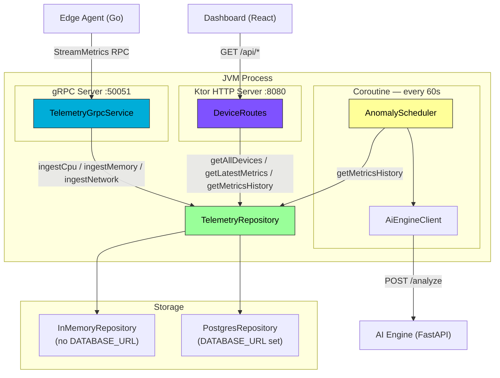

<div align="center">

# Backend — Ktor Coordination Server

[](https://kotlinlang.org)
[](https://ktor.io)
[](https://grpc.io)
[](.)

Coordination server: ingests agent telemetry over gRPC, persists to PostgreSQL, runs AI anomaly analysis, exposes metrics over REST.

</div>

---

## 📋 Table of Contents

- [Overview](#overview)
- [Architecture](#architecture)
- [API Reference](#api-reference)
- [gRPC Service](#grpc-service)
- [Building](#building)
- [Configuration](#configuration)
- [Data Flow](#data-flow)
- [Design Decisions](#design-decisions)
- [Testing](#testing)
- [Troubleshooting](#troubleshooting)

---

## Overview

The backend runs two servers in a single JVM process:

| Server | Port | Protocol | Purpose |
|--------|------|----------|---------|
| Ktor (Netty) | `8080` | HTTP/REST | Dashboard API, health checks |
| gRPC (Netty shaded) | `50051` | HTTP/2 | Agent telemetry ingestion |

They share a single `TelemetryRepository` instance. Metrics arriving via gRPC are immediately visible through the REST API.

A third component, the `AnomalyScheduler`, runs as a coroutine loop inside the same JVM process and calls the external AI engine every 60 seconds.

### Responsibilities

Each layer has one responsibility:

- `TelemetryGrpcService` — receive `Metric` messages, convert proto → model, dispatch to repository
- `TelemetryRepository` — own all storage state (interface; two implementations)
- `DeviceRoutes` — translate HTTP requests into repository queries
- `AnomalyScheduler` — query history, call AI engine, log anomalies
- `AiEngineClient` — HTTP client wrapper for the FastAPI AI engine

No layer reaches across its boundary. Proto types stop at `TelemetryGrpcService` and never appear in storage or routing code.

---

## Architecture

### Component Diagram


### Repository Selection

`buildRepository()` in `Application.kt` is the single decision point:

```
DATABASE_URL absent  →  InMemoryRepository   (dev, no Podman required)
DATABASE_URL present →  PostgresRepository   (production, persistent)
```

`TelemetryGrpcService`, `DeviceRoutes`, and `AnomalyScheduler` depend only on the `TelemetryRepository` interface — none knows which implementation is active.

---

## API Reference

All endpoints return `Content-Type: application/json`.

### `GET /api/devices`

Returns all known devices with their current summary metrics.

**Response:**
```json
{
  "devices": [
    {
      "id": "dev1",
      "name": "dev1",
      "status": "online",
      "lastSeen": "2026-02-21T20:49:10Z",
      "cpuPercent": 2.9,
      "memoryPercent": 20.1,
      "networkRxMbps": 0.002
    }
  ]
}
```

---

### `GET /api/devices/:deviceId`

Returns static device details.

**Response:**
```json
{
  "id": "dev1",
  "name": "dev1",
  "status": "online",
  "lastSeen": "2026-02-21T20:49:10Z",
  "uptime": 0,
  "platform": "Linux",
  "cpuCores": 0
}
```

---

### `GET /api/devices/:deviceId/metrics/latest`

Returns the most recent complete metric snapshot.

**Response:**
```json
{
  "cpu": {
    "usagePercent": 2.91,
    "loadAvg1m": 0.23,
    "loadAvg5m": 0.44,
    "loadAvg15m": 0.50
  },
  "memory": {
    "totalKb": 24249180,
    "availableKb": 19371520,
    "usedKb": 4877660,
    "usagePercent": 20.11
  },
  "network": [
    {
      "interfaceName": "wlp4s0",
      "rxBytesPerSec": 1583,
      "txBytesPerSec": 871
    }
  ],
  "timestamp": 1769030264084
}
```

---

### `GET /api/devices/:deviceId/metrics?from=<ms>&to=<ms>&type=<cpu|memory|network>`

Returns a time-series of scalar values for charting.

| Parameter | Type | Required | Description |
|-----------|------|----------|-------------|
| `from` | long | ✅ | Start of range (Unix ms) |
| `to` | long | ✅ | End of range (Unix ms) |
| `type` | string | ✅ | `cpu`, `memory`, or `network` |

**Response:**
```json
{
  "deviceId": "dev1",
  "type": "cpu",
  "metrics": [
    { "timestamp": 1769030254083, "value": 0.0 },
    { "timestamp": 1769030259084, "value": 1.63 },
    { "timestamp": 1769030264084, "value": 2.91 }
  ]
}
```

---

### `GET /api/health`

```json
{ "status": "healthy", "timestamp": 1769030264084 }
```

---

## gRPC Service

### Proto Schema

The backend compiles its own stubs from `src/main/proto/telemetry.proto`. The schema is wire-compatible with the agent's proto — field numbers are identical. Only the Java package option differs.

```protobuf
service TelemetryService {
  rpc StreamMetrics(stream Metric) returns (Ack);
}
```

`StreamMetrics` is a **client-streaming RPC**: the agent opens one long-lived stream and sends `Metric` messages continuously. The backend replies with a single `Ack` when the stream closes.

### Metric handling

| Payload | Handler | Storage |
|---------|---------|---------|
| `cpu` | `repository.ingestCpu()` | `metric_cpu` table |
| `memory` | `repository.ingestMemory()` | `metric_memory` table |
| `network` | `repository.ingestNetwork()` | `metric_network` table |
| `tcp` | Logged at DEBUG | Not persisted (Phase 6 validation only) |

The `tcp` payload is received and logged correctly; persistent storage would require a `metric_tcp` table and `ingestTcp()` on the repository interface.

---

## Building

### Prerequisites
```bash
java --version   # >= 21
# Protobuf code generated by Gradle protobuf plugin — no manual protoc needed
```

### Run in development
```bash
./gradlew run
```

With database and AI engine:
```bash
DATABASE_URL=jdbc:postgresql://localhost:5432/telemetry \
AI_ENGINE_URL=http://localhost:8000 \
./gradlew run
```

### Build a fat JAR
```bash
./gradlew build
java -jar build/libs/edge-telemetry-backend-*.jar
```

### Regenerate protobuf stubs
```bash
./gradlew generateProto
# Output: build/generated/source/proto/main/ (excluded from git)
```

---

## Configuration

All configuration is read from environment variables. Defaults match `compose.yaml` and `backend/compose.yaml` for zero-config local dev.

| Variable | Default | Description |
|----------|---------|-------------|
| `HTTP_PORT` | `8080` | Ktor REST server port |
| `GRPC_PORT` | `50051` | gRPC server port |
| `DATABASE_URL` | _(absent)_ | JDBC URL; absent → in-memory repository |
| `DATABASE_USER` | `telemetry` | PostgreSQL username |
| `DATABASE_PASSWORD` | `telemetry` | PostgreSQL password |
| `DATABASE_POOL_SIZE` | `10` | HikariCP connection pool size |
| `AI_ENGINE_URL` | _(absent)_ | FastAPI base URL; absent → scheduler disabled |
| `ANOMALY_INTERVAL_SECONDS` | `60` | Scheduler run interval |
| `ANOMALY_WINDOW_MINUTES` | `60` | History window sent to AI engine |

---

## Data Flow

### Proto → Model boundary

Proto types are converted to Kotlin model types (`CpuMetric`, `MemoryMetric`, `NetworkInterface`) inside `TelemetryGrpcService.streamMetrics()`. This is the only file in the codebase that imports generated proto classes. All downstream code — repository, routes, scheduler — works exclusively with `Models.kt` types.

### PostgreSQL schema

Three append-only metric tables with composite indexes on `(device_id, ts DESC)`:

```sql
metric_cpu     -- one row per 5s collection cycle
metric_memory  -- one row per 5s collection cycle
metric_network -- one row per interface per 5s cycle
```

A `devices` table holds mutable summary state (latest cpu%, memory%, last_seen) updated on every ingest call, so `GET /api/devices` never needs to JOIN metric tables.

`touchDevice()` uses `INSERT ... ON CONFLICT DO UPDATE` (upsert) — atomic and safe under concurrent agent connections.

### Anomaly detection cycle

Every `ANOMALY_INTERVAL_SECONDS` seconds:
1. Fetch all non-mock device IDs from repository
2. For each device: query last `ANOMALY_WINDOW_MINUTES` of cpu/memory/network history
3. POST to `AI_ENGINE_URL/analyze`
4. Log `ANOMALY` at WARN if any metric's z-score ≥ threshold
5. Log `ACTIONABLE` at WARN if overall_risk ≥ 0.8

Per-device coroutines run concurrently under a `SupervisorJob` — one device's failure does not cancel others.

---

## Design Decisions

### Why `TelemetryRepository` interface instead of concrete class

Two implementations are needed: `InMemoryRepository` (zero external dependencies, for dev/test) and `PostgresRepository` (persistent). The interface means `TelemetryGrpcService`, `DeviceRoutes`, and `AnomalyScheduler` are all frozen — only `buildRepository()` in `Application.kt` changes when the backing store changes.

### Why `grpc-netty-shaded` instead of `grpc-netty`

Ktor uses Netty internally. `grpc-netty` (unshaded) causes classpath version conflicts. `grpc-netty-shaded` bundles Netty under a relocated package, eliminating the conflict. The two Netty instances coexist without interference.

### Why Exposed DSL and not DAO or Hibernate

The schema is fixed at compile time. DSL gives full visibility into every SQL statement and integrates naturally with Kotlin coroutines via `newSuspendedTransaction { }`. Hibernate's ORM abstraction adds complexity without benefit when all queries are explicit.

### Why CIO engine for `AiEngineClient`

CIO (Coroutine I/O) is Kotlin-native, requires no additional native dependencies, and is sufficient for simple outbound HTTP calls. OkHttp would be appropriate for HTTP/2 push or advanced proxy support — neither applies here.

### Why `AiEngineClient.analyze()` returns null instead of throwing

The AI engine is an optional enhancement. If it is down or times out, the backend logs a warning and the scheduler skips that cycle. A thrown exception would cancel the coroutine's flow and silence future cycles. Null-on-failure keeps the detection loop resilient.

---

## Testing

### Integration test: full pipeline
```bash
# Terminal 1
./gradlew run  # or with DATABASE_URL for persistence

# Terminal 2
cd ../agent && ./bin/agent --device-id=dev1 --interval=5s

# Terminal 3
watch -n 5 'http GET localhost:8080/api/devices/dev1/metrics/latest'
```

### Test: AI anomaly detection
```bash
# Start AI engine
cd ../ai-engine && python main.py &

AI_ENGINE_URL=http://localhost:8000 \
ANOMALY_INTERVAL_SECONDS=10 \
./gradlew run

# After 10 samples (~50s), run the CPU stress script
../scripts/sim-high-cpu.sh dev1 60
# Watch for: ANOMALY  device=dev1  metric=cpu  z=...
```

### Test: reconnection
```bash
# Agent running, backend running
pkill -f "edge-telemetry-backend"
./gradlew run
# Agent logs: "Stream to backend lost" → backoff → "Connected"
```

### Test: multiple agents
```bash
./bin/agent --device-id=dev1 &
./bin/agent --device-id=dev2 &
./bin/agent --device-id=dev3 &
http GET localhost:8080/api/devices | jq '[.devices[].id]'
# ["dev1", "dev2", "dev3", "mock-prod-01", "mock-db-01", "mock-edge-03"]
```

---

## Troubleshooting

| Issue | Cause | Solution |
|-------|-------|----------|
| `ALREADY_EXISTS` on gRPC startup | Port 50051 in use | `lsof -i :50051` |
| Dashboard shows only mock devices | Agent not running | Check agent logs for "Connected" |
| `StatusException: UNAVAILABLE` | Backend not running | Start backend first |
| `null` in latest endpoint | Snapshot bucket incomplete | Wait one full cycle (5s) |
| AI anomaly scheduler not starting | `AI_ENGINE_URL` not set | Set env var and restart |
| `WARN AI engine unreachable` | FastAPI not running | Start `python main.py` in `ai-engine/` |

---

<div align="center">

**[⬆ Back to Project Root](../README.md)**

</div>
