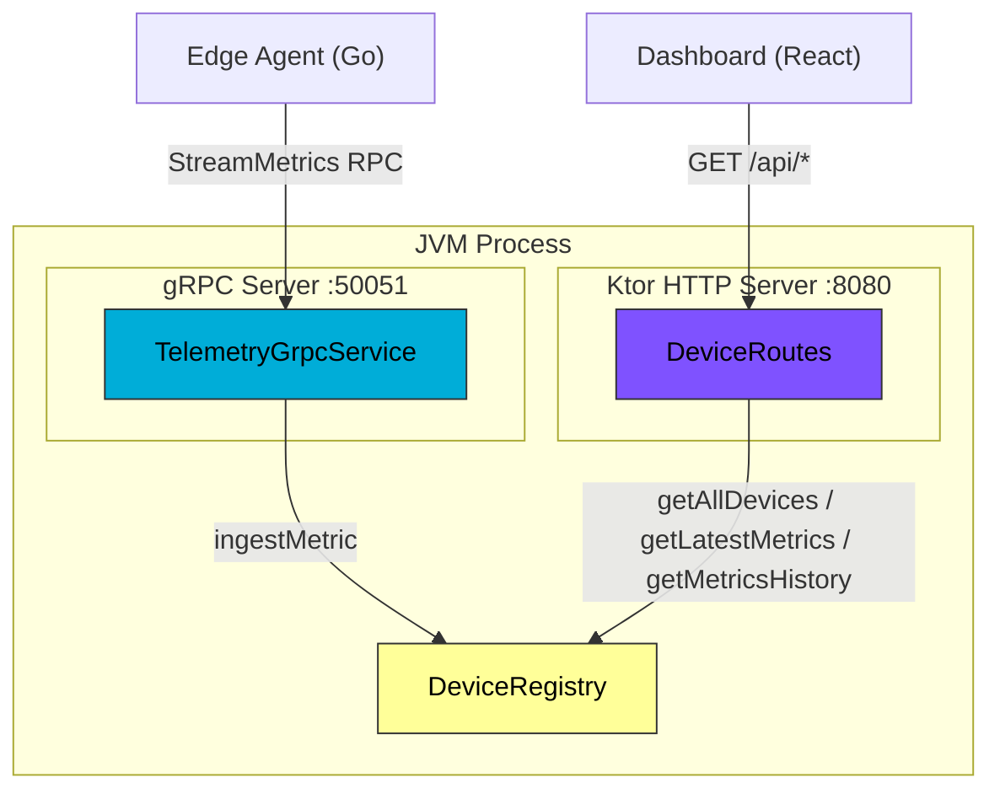
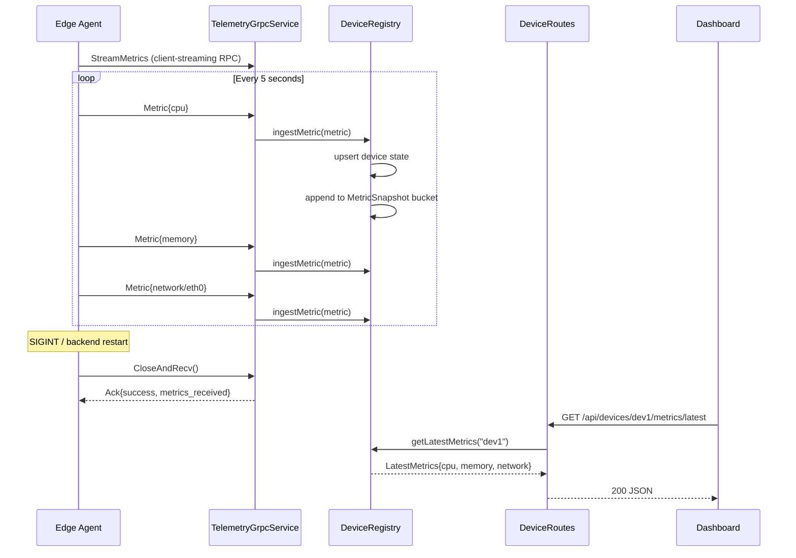

<div align="center">

# Backend — Ktor Coordination Server

[](https://kotlinlang.org)
[](https://ktor.io)
[](https://grpc.io)
[](.)

Coordination server: ingests agent telemetry over gRPC, exposes metrics over REST.

</div>

---

## 📋 Table of Contents

- [Overview](#overview)
- [Architecture](#architecture)
- [API Reference](#api-reference)
- [gRPC Service](#grpc-service)
- [Building](#building)
- [Configuration](#configuration)
- [Data Flow](#data-flow)
- [Design Decisions](#design-decisions)
- [Testing](#testing)
- [Troubleshooting](#troubleshooting)

---

## Overview

The backend runs two servers in a single JVM process:

| Server | Port | Protocol | Purpose |
|--------|------|----------|---------|
| Ktor (Netty) | `8080` | HTTP/REST | Dashboard API, health checks |
| gRPC (Netty shaded) | `50051` | HTTP/2 | Agent telemetry ingestion |

They share a single `DeviceRegistry` instance in memory. Metrics arriving via gRPC are immediately visible through the REST API — no IPC, no serialization between the two transports.

### Responsibilities

The backend has one responsibility per layer:

- `TelemetryGrpcService` — receive `Metric` messages from agents, nothing else
- `DeviceRegistry` — own all state, expose a clean read/write interface
- `DeviceRoutes` — translate HTTP requests into registry queries, nothing else

No layer reaches across its boundary.

---

## Architecture

### Component Diagram


### Request Lifecycle — Agent Metric


---

## API Reference

All endpoints return `Content-Type: application/json`.

### `GET /api/devices`

Returns all known devices with their current summary metrics.

**Response:**
```json
{
  "devices": [
    {
      "id": "dev1",
      "name": "dev1",
      "status": "online",
      "lastSeen": "2026-02-21T20:49:10Z",
      "cpuPercent": 2.9,
      "memoryPercent": 20.1,
      "networkRxMbps": 0.002
    }
  ]
}
```

---

### `GET /api/devices/:deviceId`

Returns static device details (platform, CPU cores, uptime).

**Response:**
```json
{
  "id": "dev1",
  "name": "dev1",
  "status": "online",
  "lastSeen": "2026-02-21T20:49:10Z",
  "uptime": 0,
  "platform": "Linux",
  "cpuCores": 0
}
```

> `cpuCores` and `uptime` will be populated in Phase 3 when the agent sends a system-info message on connect.

---

### `GET /api/devices/:deviceId/metrics/latest`

Returns the most recent complete metric snapshot for a device.

**Response:**
```json
{
  "cpu": {
    "usagePercent": 2.91,
    "loadAvg1m": 0.23,
    "loadAvg5m": 0.44,
    "loadAvg15m": 0.50
  },
  "memory": {
    "totalKb": 24249180,
    "availableKb": 19371520,
    "usedKb": 4877660,
    "usagePercent": 20.11
  },
  "network": [
    {
      "interfaceName": "wlp4s0",
      "rxBytesPerSec": 1583,
      "txBytesPerSec": 871
    }
  ],
  "timestamp": 1769030264084
}
```

---

### `GET /api/devices/:deviceId/metrics?from=<ms>&to=<ms>&type=<cpu|memory|network>`

Returns a time-series of scalar values for charting. `from` and `to` are Unix milliseconds.

**Query parameters:**

| Parameter | Type | Required | Description |
|-----------|------|----------|-------------|
| `from` | long | ✅ | Start of range (Unix ms) |
| `to` | long | ✅ | End of range (Unix ms) |
| `type` | string | ✅ | `cpu`, `memory`, or `network` |

**Response:**
```json
{
  "deviceId": "dev1",
  "type": "cpu",
  "metrics": [
    { "timestamp": 1769030254083, "value": 0.0 },
    { "timestamp": 1769030259084, "value": 1.63 },
    { "timestamp": 1769030264084, "value": 2.91 }
  ]
}
```

---

### `GET /api/health`

```json
{ "status": "healthy", "timestamp": 1769030264084 }
```

---

## gRPC Service

### Proto Schema

The backend compiles its own stubs from `src/main/proto/telemetry.proto`. The schema is wire-compatible with the agent's `agent/proto/telemetry.proto` — field numbers are identical. Only the Java package option differs.

```protobuf
service TelemetryService {
  rpc StreamMetrics(stream Metric) returns (Ack);
}
```

`StreamMetrics` is a **client-streaming RPC**: the agent opens one long-lived stream and sends `Metric` messages continuously. The server replies with a single `Ack` when the stream closes.

### Testing with grpcurl

```bash
# With reflection enabled (add grpc-services to build.gradle.kts)
grpcurl -plaintext localhost:50051 list

# Without reflection — pass the proto directly
grpcurl -plaintext \
  -proto src/main/proto/telemetry.proto \
  -d '{
    "device_id": "test-grpcurl",
    "timestamp": 1700000000000,
    "status": 1,
    "cpu": { "usage_percent": 42.5, "load_avg_1m": 1.2 }
  }' \
  localhost:50051 telemetry.v1.TelemetryService/StreamMetrics

# Verify it landed in the REST API
curl http://localhost:8080/api/devices | jq '.devices[] | select(.id == "test-grpcurl")'
```

---

## Building

### Prerequisites
```bash
java --version   # >= 21
# Protobuf code is generated by the Gradle protobuf plugin — no manual protoc needed
```

### Run in development
```bash
./gradlew run
```

### Build a fat JAR
```bash
./gradlew build
java -jar build/libs/edge-telemetry-backend-0.2.0.jar
```

### Regenerate protobuf stubs
```bash
# Stubs are regenerated automatically on every build.
# To force regeneration without a full build:
./gradlew generateProto
```

Generated files land in `build/generated/source/proto/main/` and are excluded from git.

---

## Configuration

All configuration is currently hardcoded in `Application.kt`. Phase 3 will introduce environment-variable configuration for the database connection. Current defaults:

| Setting | Value | Notes |
|---------|-------|-------|
| HTTP port | `8080` | Ktor/Netty |
| gRPC port | `50051` | gRPC/Netty shaded |
| History window | 1 hour | In-memory, per device |
| Metric channel buffer | n/a | Handled by gRPC flow control |
| CORS | `anyHost()` | Restrict in production |

---

## Data Flow

### MetricSnapshot bucket design

The agent sends CPU, Memory, and Network as **separate gRPC messages** within the same 5-second collection cycle, all carrying the same timestamp. The backend accumulates them into a single `MetricSnapshot`:

```
t=0ms  → Metric{cpu}      → bucket.cpu    = CpuMetric(...)
t=1ms  → Metric{memory}   → bucket.memory = MemoryMetric(...)
t=2ms  → Metric{network}  → bucket.network += NetworkInterface(...)
```

A 1-second tolerance window prevents clock jitter from creating duplicate buckets. Each field is nullable — a partial snapshot (e.g. if the network collector fails) still records the CPU and memory data.

### Memory management

The history list for each device is capped at 1 hour of data. Entries older than `now - 3600s` are evicted on every ingest call. This bounds memory at approximately:

```
720 samples/hour × 3 metrics × ~200 bytes = ~430 KB per device
```

Acceptable for Phase 2. Phase 3 moves this to PostgreSQL.

### Mock vs real devices

Mock devices use IDs prefixed `mock-` (`mock-prod-01`, `mock-db-01`, `mock-edge-03`). They are seeded on startup and updated on every `GET /api/devices` call to simulate live data. A real agent using `--device-id=dev1` creates a separate registry entry and never overwrites mock data.

---

## Design Decisions

### Why grpc-netty-shaded instead of grpc-netty?

Ktor uses Netty internally. `grpc-netty` (unshaded) would cause classpath version conflicts between Ktor's Netty and gRPC's Netty. `grpc-netty-shaded` bundles Netty under a relocated package, eliminating the conflict entirely. The two Netty instances coexist without interference.

### Why two ports instead of one?

gRPC requires HTTP/2 with binary framing. Ktor's REST API uses HTTP/1.1 or HTTP/2 with JSON. Running them on the same port would require an HTTP version multiplexer (h2c upgrade negotiation). Two ports is simpler, operationally clearer, and matches standard industry practice (e.g. Envoy sidecar patterns use separate ports for gRPC and REST).

### Why plain-text gRPC (no TLS)?

TLS termination belongs at the load balancer / ingress layer in production. Inside the Podman network (Phase 5), agent-to-backend communication is on a private bridge network. Adding TLS at the application layer before the network topology is defined would be premature — and would complicate the agent's certificate management without providing security.

### Why Mutex over Channel-based concurrency?

`DeviceRegistry` is accessed from two goroutine contexts: the gRPC service (writes via `ingestMetric`) and Ktor's route handlers (reads via `getAllDevices` etc.). A single `Mutex` is the right tool — it makes the critical sections explicit and is easy to reason about. A channel-based actor pattern would add indirection for no benefit at this scale.

---

## Testing

### Integration test: full pipeline

```bash
# Terminal 1: start backend
./gradlew run

# Terminal 2: start agent
cd ../agent
./bin/agent --device-id=dev1 --interval=5s

# Terminal 3: verify
watch -n 5 'curl -s http://localhost:8080/api/devices/dev1/metrics/latest | jq .cpu'
# Should show incrementing timestamps and realistic CPU values from /proc/stat
```

### Test: reconnection

```bash
# Agent running, backend running
# Kill the backend — agent logs WARN within ~15s (keepalive timeout)
pkill -f "edge-telemetry-backend"

# Restart the backend
./gradlew run

# Agent logs: "Connected to backend at localhost:50051"
# Metrics resume — no manual intervention
```

### Test: multiple agents

```bash
# Each agent needs a unique device-id
./bin/agent --device-id=dev1 --interval=5s &
./bin/agent --device-id=dev2 --interval=5s &
./bin/agent --device-id=dev3 --interval=5s &

curl http://localhost:8080/api/devices | jq '[.devices[].id]'
# ["dev1", "dev2", "dev3", "mock-prod-01", "mock-db-01", "mock-edge-03"]
```

---

## Troubleshooting

| Issue | Cause | Solution |
|-------|-------|----------|
| `ALREADY_EXISTS` on gRPC startup | Port 50051 in use | `lsof -i :50051` to find the process |
| Dashboard shows only mock devices | Agent not running or wrong `--backend-addr` | Check agent logs for "Connected" |
| `StatusException: UNAVAILABLE` in agent | Backend not running | Start backend first, agent reconnects automatically |
| Metrics show `null` in latest endpoint | Snapshot bucket incomplete | Wait one full collection cycle (5s) |
| High memory after many hours | History eviction not triggered | Eviction runs on ingest; no ingest = no eviction. Phase 3 (PostgreSQL) resolves this |

---

## Future Enhancements

- [ ] PostgreSQL persistence (Phase 3)
- [ ] Environment-variable configuration (Phase 3)
- [ ] gRPC server reflection for development (`grpc-services`)
- [ ] gRPC control stream back to agent (Phase 4)
- [ ] System-info message from agent on connect (populate `cpuCores`, `uptime`)
- [ ] Metric aggregation endpoint (min/max/avg over time range)

---

<div align="center">

**[⬆ Back to Project Root](../README.md)**

</div>
